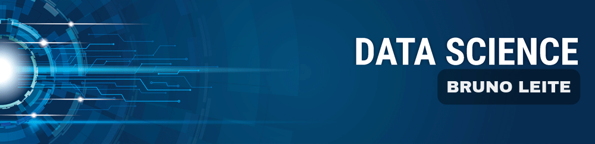

   

  

# Bruno Leite
*Lead Data Scientist* at Space Operations Center

Data Scientist motivated and studying/working with data science. Interested in working on data area to solve problems and decision-making. Developed projects in the area of computer vision using all necessary tools, applying machine learning and deep learning methods. Working on data generation and manipulation.

Cientista de dados motivado e estudando/trabalhando com ciência de dados. Interessado em trabalhar na área de dados, com o intuito de resolver problemas e gerar tomadas de decisões. Desenvolveu projeto na área de visão computacional utilizando as principais ferramentas, aplicando métodos de machine learning e deep learning. Experiência com geração e manipulação de dados.

**Background in:** Python, SQL, Machine Learning and Deep Learning

**Links:**
* [LinkedIn](https://www.linkedin.com/in/brunodsleite)
* [Medium](https://bruno-d-leite.medium.com)
* [Kaggle](https://www.kaggle.com/brunodleite)

## Projetos:
Projeto realizados baseado em dados reais:

* **Detecção de câncer de pele:** https://bit.ly/Skin_Cancer_ML

---

